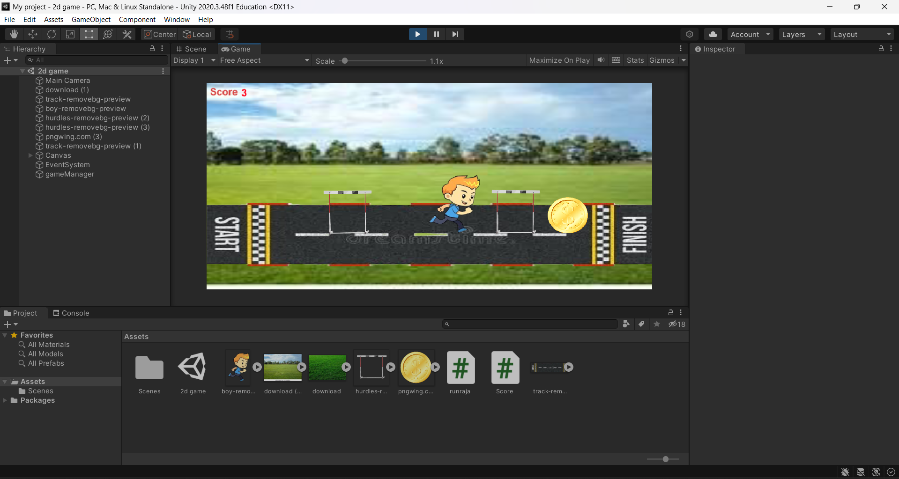

# Ex3 Hurdle Game 2D

## AIM:
To develop a 2D game using C# program in unity.

## ALGORITHM:
Step 1: Create a new project.

Step 2: Click Content browser -> Drag the file into the unity -> Place the assets in side the view port in unity.

Step 3: Define the physics properties to the objects such as collide.

Step 4: Assets -> Create -> # Script.

Step 5: Create a folder name Coding and create a C# file to add the coding in it.

Step 6: To add our C# Script file to our selected object, click on the C# Script file and drag it to our selected objects in the Hierarchy window nad run the application.

Step 7: Stop. 

## PROGRAM:
playerControl.cs

```cs
using System.Collections;
using System.Collections.Generic;
using UnityEngine;

public class playerControl : MonoBehaviour
{
    public float speed;
    public float jumpforce;
    private Rigidbody2D rb;
    public Score cc;
    void Start()
    {
        rb=GetComponent<Rigidbody2D>();
    }

    // Update is called once per frame
    void Update()
    {
        float moveinp=Input.GetAxisRaw("Horizontal");
        transform.position += new Vector3(moveinp,0,0)*speed*Time.deltaTime;
        if (Input.GetKeyDown(KeyCode.Space)&&Mathf.Abs(rb.velocity.y)<0.001f)
        {
            rb.AddForce(new Vector2(0, jumpforce), ForceMode2D.Impulse);
        }
    }
    private void OnTriggerEnter2D(Collider2D other)
    {
        if(other.CompareTag( "destory"))   //if(other.gameObject.tag=="destory")
        {
            cc.coincount++;
            Destroy(other.gameObject); 
        }  
    }
}   
```
Score.cs

```cs
using System.Collections;
using System.Collections.Generic;
using UnityEngine;
using UnityEngine.UI;
public class Score : MonoBehaviour
{
    public int coincount;
    public Text value;
    // Start is called before the first frame update
    void Start()
    {
        
    }

    // Update is called once per frame
    void Update()
    {
        value.text=coincount.ToString();
    }
}
```

## OUTPUT: 


## RESULT:
Thus the 2D game using C# program in unity is developed successfully.
